# Describe & explore


Here, we get the descriptive info for both studies that we report in the Method section of the paper.

We used these packages:


```r
library(pacman)
p_load(
  knitr,
  here,
  visdat,
  scales,
  patchwork,
  sjPlot,
  cowplot,
  janitor,
  ggbeeswarm,
  lemon,
  lubridate,
  tidyverse
)
```


Then, we load the data sets.


```r
ac <- read_rds(here("data/noa/ac-excluded.rds"))
pvz <- read_rds(here("data/ea/pvz-excluded.rds"))

ac_full <- read_rds(here("data/noa/ac.rds"))
pvz_full <- read_rds(here("data/ea/pvz.rds"))
```

Join the two data sets.


```r
ac <- ac %>% 
  select(
    player_id, gender, created, age,
    spane_balance, spane_positive, spane_negative, 
    spane_game_balance, within_estimate, between_estimate,
    autonomy, 
    competence, relatedness, enjoyment, 
    extrinsic, active_play, Hours
  )
pvz <- pvz %>% 
  select(
    player_id, gender, created = date, age,
    spane_balance, spane_positive, spane_negative,
    spane_game_balance, within_estimate, between_estimate,
    autonomy, 
    competence, relatedness, enjoyment, 
    extrinsic, active_play, Hours
  )
dat <- bind_rows(pvz, ac, .id = "Game") %>% 
  mutate(Game = factor(Game, labels = c("PvZ", "AC:NH")))
```

## Demographics

In total, 6484 players responded to the survey.
Their mean age was *M* = 31 with a standard deviation of *SD* = 10.

Ages by study:


```r
dat %>% 
  group_by(Game) %>% 
  summarise(
    m_age = mean(age, na.rm = TRUE),
    s_age = sd(age, na.rm = TRUE),
    min_age = min(age, na.rm = TRUE),
    max_age = max(age, na.rm = TRUE)
    )
#> # A tibble: 2 x 5
#>   Game  m_age s_age   min_age   max_age
#>   <fct> <dbl> <dbl> <dbl+lbl> <dbl+lbl>
#> 1 PvZ    34.9 11.8         18        99
#> 2 AC:NH  30.9  9.68        18        99
```

Then let's look at the sex distribution.

```r
tabyl(pvz, gender) %>% adorn_pct_formatting()
#>             gender   n percent
#>               Male 404   78.1%
#>             Female  94   18.2%
#>              Other   2    0.4%
#>  Prefer not to say  17    3.3%
tabyl(ac, gender) %>% adorn_pct_formatting()
#>                                  gender    n percent valid_percent
#>                                  Female 2462   41.3%         42.3%
#>                                    Male 3124   52.4%         53.6%
#>                                   Other  153    2.6%          2.6%
#>                       Prefer not to say   88    1.5%          1.5%
#>  Item was never rendered for this user.    0    0.0%          0.0%
#>                                    <NA>  140    2.3%             -
```

## Survey dates


```r
dat %>% 
  mutate(Date = as.Date(created)) %>% 
  count(Game, Date) %>% 
  kable()
```


|Game  |Date       |    n|
|:-----|:----------|----:|
|PvZ   |2020-08-11 |   69|
|PvZ   |2020-08-12 |    9|
|PvZ   |2020-08-13 |    7|
|PvZ   |2020-08-15 |    1|
|PvZ   |2020-08-16 |    1|
|PvZ   |2020-08-17 |    1|
|PvZ   |2020-08-18 |    1|
|PvZ   |2020-08-20 |    1|
|PvZ   |2020-08-21 |    1|
|PvZ   |2020-08-23 |    1|
|PvZ   |2020-08-28 |    1|
|PvZ   |2020-09-24 |  320|
|PvZ   |2020-09-25 |   64|
|PvZ   |2020-09-26 |   21|
|PvZ   |2020-09-27 |   12|
|PvZ   |2020-09-28 |    5|
|PvZ   |2020-09-29 |    2|
|AC:NH |2020-10-27 |  236|
|AC:NH |2020-10-28 | 4942|
|AC:NH |2020-10-29 |  450|
|AC:NH |2020-10-30 |  171|
|AC:NH |2020-10-31 |   57|
|AC:NH |2020-11-01 |   55|
|AC:NH |2020-11-02 |   56|

## Response rates


```r
# PvZ wave 1
p1 <- nrow(pvz_full %>% filter(date < ymd("2020-09-01")))
# PvZ wave 2
p2 <- nrow(pvz_full %>% filter(date > ymd("2020-09-01")))
# AC:NH
a1 <- nrow(ac)
tibble(
  Game = c("PvZ w1", "PvZ w2", "AC:NH"),
  Invitations = c(50000, 200000, 342825),
  Responses = c(p1, p2, a1),
  Rate = percent(Responses/Invitations, .01)
)
#> # A tibble: 3 x 4
#>   Game   Invitations Responses Rate 
#>   <chr>        <dbl>     <int> <chr>
#> 1 PvZ w1       50000        94 0.19%
#> 2 PvZ w2      200000       424 0.21%
#> 3 AC:NH       342825      5967 1.74%
```

How many individuals had telemetry


```r
foo <- function(data) {
  data %>% 
    transmute(has_telemetry = !is.na(Hours)) %>% 
    tabyl(has_telemetry) %>% 
    adorn_pct_formatting()
}
map(list(pvz=pvz_full, ac=ac_full), foo) %>% kable
```


<table class="kable_wrapper">
<tbody>
  <tr>
   <td> 

|has_telemetry |   n|percent |
|:-------------|---:|:-------|
|FALSE         |  47|9.1%    |
|TRUE          | 471|90.9%   |

 </td>
   <td> 

|has_telemetry |    n|percent |
|:-------------|----:|:-------|
|FALSE         | 3219|53.9%   |
|TRUE          | 2756|46.1%   |

 </td>
  </tr>
</tbody>
</table>

## Missingness


```r
vis_miss(pvz)
```

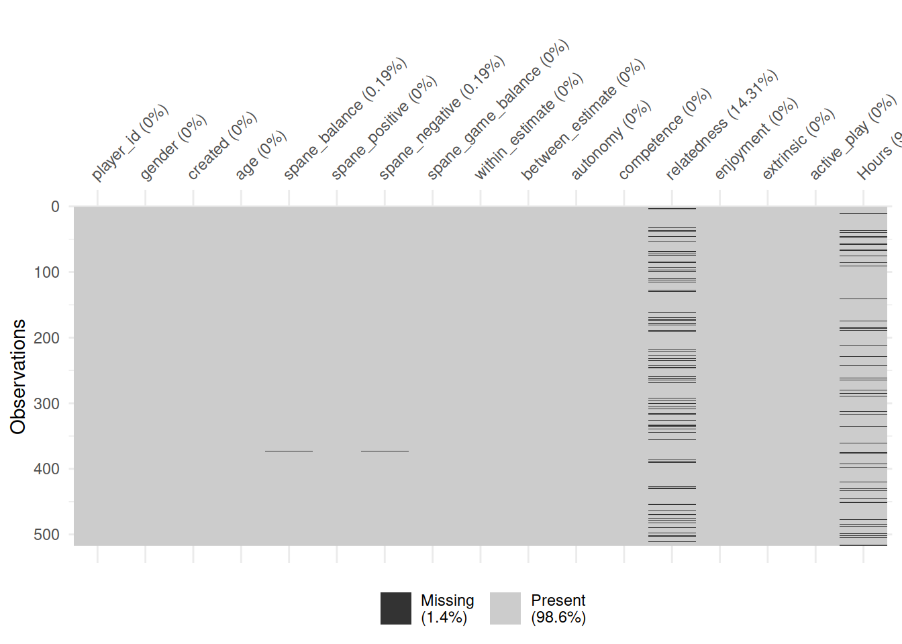

```r
vis_miss(ac)
```

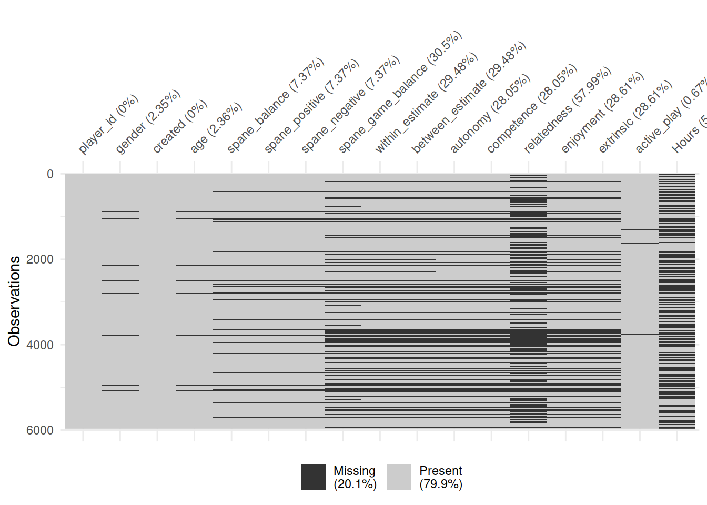

## Univariate figures

This figure shows the distribution of well-being and motivation scores for both studies


```r
tmp <- dat %>%
  pivot_longer(c(spane_balance, autonomy:extrinsic))
tmp <- tmp %>% 
  mutate(
    name = factor(
      name, 
      levels = c(
        "spane_balance", "extrinsic", "enjoyment", 
        "autonomy", "competence", "relatedness"
      ),
      labels = c(
        "Player well-being", "Extrinsic motivation", "Intrinsic motivation", 
        "Player autonomy", "Player competence", "Player relatedness"
      )
    )
  )
tmp2 <- tmp %>% 
  group_by(Game, name) %>% 
  summarise(value = mean(value, na.rm = TRUE))
filter(tmp, Game == "PvZ") %>%  
  ggplot(aes(value, col = Game, fill = Game)) +
  coord_cartesian(ylim = c(-1, 1)) +
  scale_color_manual(
    values = rev(colors), aesthetics = c("color", "fill"),
    guide = guide_legend(reverse = TRUE)
    ) +
  geom_histogram(
    aes(y = stat(ncount)),
    col = "white", bins = 20
    ) +
  geom_histogram(
    data = filter(tmp, Game == "AC:NH"),
    aes(y = stat(ncount)*-1), col = "white", bins = 20
    ) +
  scale_y_continuous(
    breaks = c(-1, -.5, 0, .5, 1), labels = c(1, .5, 0, .5, 1)
  ) +
  scale_x_continuous("Value", breaks = pretty_breaks()) +
  geom_point(
    data = tmp2, aes(y = -1.01),
    shape = 25, size = 2.5
    ) +
  # Make sure 1 is shown on all figures by drawing a blank geom
  geom_blank(data = tibble(Game = "PvZ", value = 1)) +
  labs(y = "Normalized count") +
  facet_wrap("name", scales = "free") +
  theme(axis.title.x = element_blank(), legend.position = "right")
```

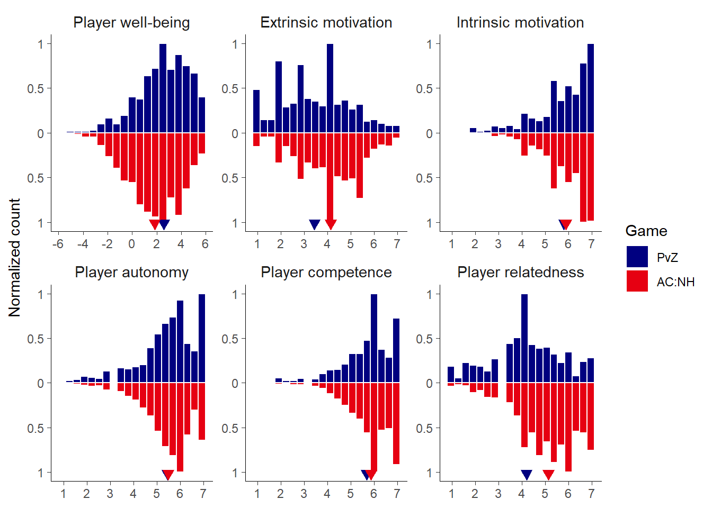

And then a summary figure of the times, subjective and objective


```r
tmp <- dat %>% 
  group_by(Game) %>% 
  summarise(
    across(
      c(Hours, active_play), 
      list(m = ~mean(., na.rm = TRUE), s = ~sd(., na.rm = TRUE))
    )
  )
dat %>%  
  ggplot(aes(col = Game, fill = Game)) +
  coord_cartesian(ylim = c(-1, 1), xlim = c(0, 80)) +
  scale_color_manual(values = colors, aesthetics = c("color", "fill")) +
  scale_y_continuous(
    breaks = c(-1, -.5, 0, .5, 1), labels = c(1, .5, 0, .5, 1),
    expand = expansion(.015)
  ) +
  scale_x_continuous(breaks = pretty_breaks(7)) +
  geom_histogram(
    aes(x = Hours, y = stat(ncount)), 
    bins = 80, col = "white"
    ) +
  geom_histogram(
    aes(x = active_play, y = stat(ncount)*-1), 
    bins = 80, alpha = 0.5, col = "white"
  ) +
  geom_point(
    data = tmp, aes(x = Hours_m, y = -0.97),
    shape = 25, size = 2.5
  ) +
  geom_point(
    data = tmp, aes(x = active_play_m, y = -0.97),
    shape = 25, size = 2.5, alpha = 0.5
  ) +
  labs(y = "Normalized count") +
  facet_rep_wrap("Game", scales = "fixed", nrow = 2) +
  theme(strip.text = element_blank(), legend.position = "right")
```

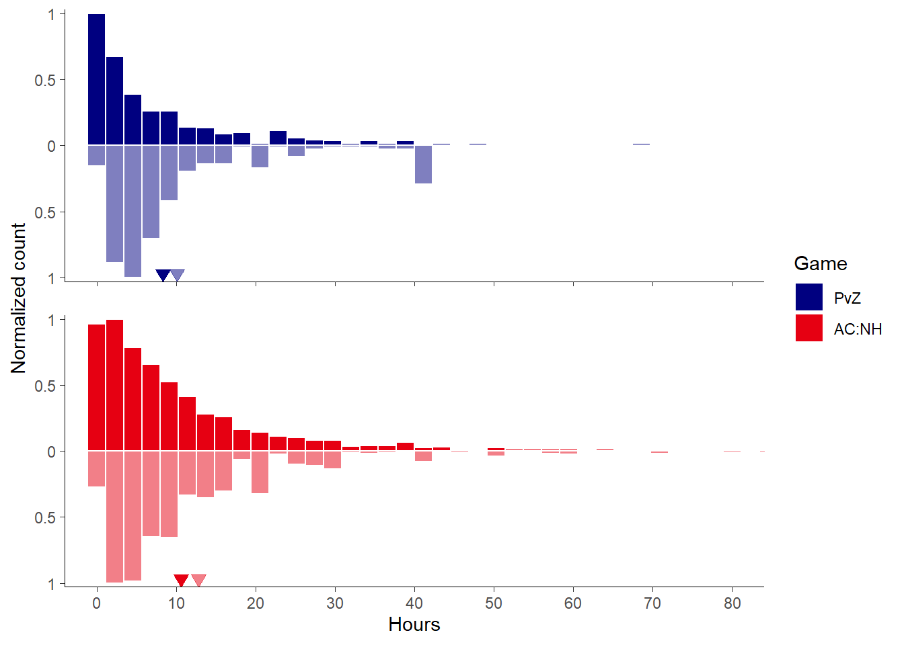

```r

tmp
#> # A tibble: 2 x 5
#>   Game  Hours_m Hours_s active_play_m active_play_s
#>   <fct>   <dbl>   <dbl>         <dbl>         <dbl>
#> 1 PvZ      8.35    11.4          10.1          10.7
#> 2 AC:NH   10.6     12.7          12.8          17.0
dat %>% 
  group_by(Game) %>% 
  summarise(across(active_play:Hours, ~sum(.x>80, na.rm = TRUE)))
#> # A tibble: 2 x 3
#>   Game  active_play Hours
#>   <fct>       <int> <int>
#> 1 PvZ             0     0
#> 2 AC:NH          61     7
```

## Correlation matrices


```r
cormat <- function(data, title) {
  data %>% 
    rename_all(str_to_title) %>% 
    psych::cor.plot(
      scale = FALSE, stars = TRUE, 
      xlas = 2, show.legend = FALSE,
      main = str_glue("{title} correlation matrix"),
    )
}

select(pvz, where(is.numeric)) %>% 
  cormat("PvZ")
```

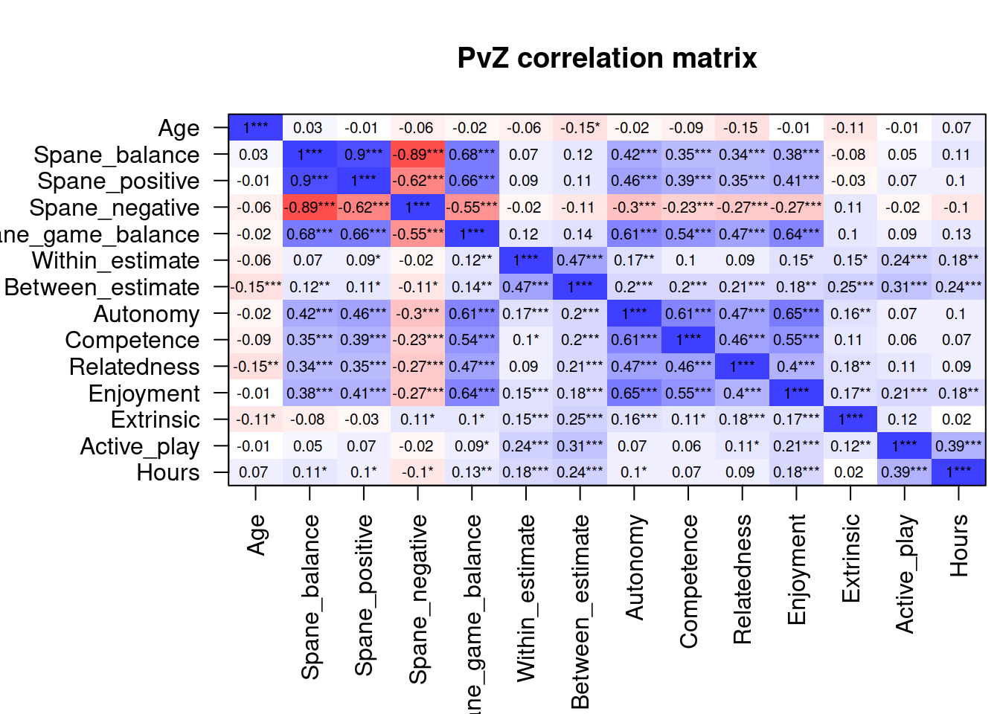

```r
select(ac, where(is.numeric)) %>% 
  cormat("AC:NH")
```

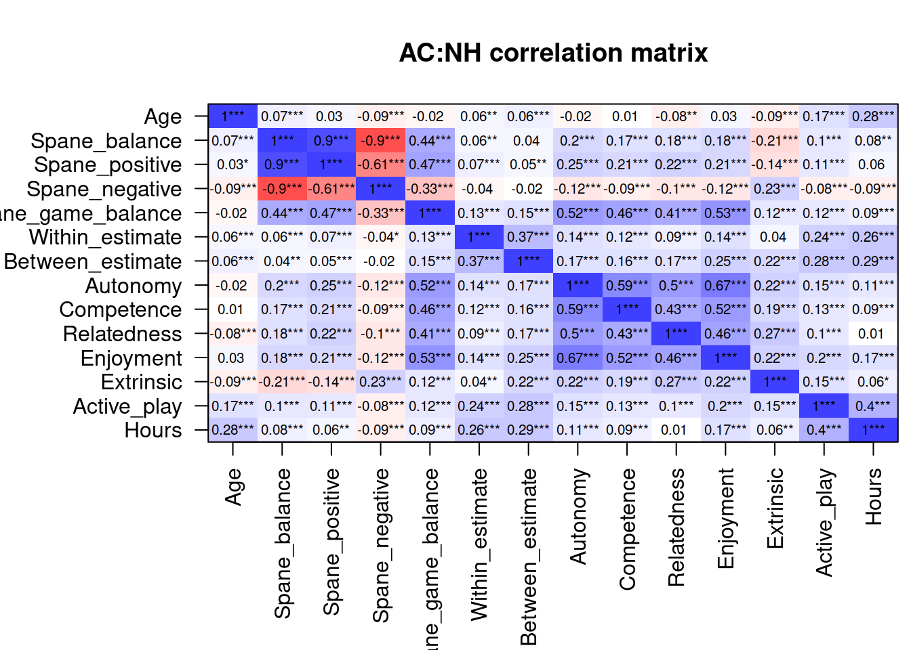

Then we will draw scatterplot matrices, with this custom function:


```r
lm_function <- 
  function(
    data, 
    mapping, 
    ...
    ){
  p <- 
    ggplot(
      data = data, 
      mapping = mapping
      ) + 
    geom_point(
      color = "#56B4E9",
      alpha = 0.5
    ) + 
    geom_smooth(
      method=lm, 
      fill="#0072B2", 
      color="#0072B2", 
      ...)
  p
}

dens_function <-
  function(
    data,
    mapping,
    ...
  ){
    p <- 
      ggplot(
        data = data,
        mapping = mapping
      ) +
      geom_density(fill = "#009E73", color = NA, alpha = 0.5)
  }

pair_plot <- 
  function(
    dat
  ) {
    GGally::ggpairs(
      data = dat,
      lower = list(continuous = lm_function), # custom helper function
      diag = list(continuous = dens_function), # custom helper function
    ) +
      theme(
        axis.line=element_blank(),
        axis.text.x=element_blank(),
        axis.text.y=element_blank(),
        axis.ticks=element_blank(),
        axis.title.y=element_blank(),
        axis.title.x=element_blank(),
        legend.position="none",
        panel.background=element_blank(),
        panel.border=element_blank(),
        panel.grid.major=element_blank(),
        panel.grid.minor=element_blank(),
        plot.background=element_blank(),
        strip.background = element_blank()
      )
  }
```

### Well-being & motivations correlations

Let's have a look at the correlations between the concepts of well-being and motivations (aggregated).

```r
# call the function
pair_plot(
  dat%>% 
    select(
      spane_balance:extrinsic,
      spane_game_balance
    )
)
```

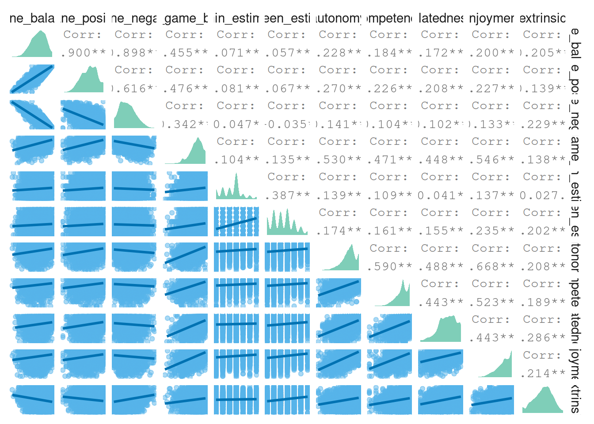

### More well-being correlations

Then correlations between well-being, autonomy motivation, enjoyment, and extrinsic motivation.

```r
pair_plot(
  dat %>% 
    select(
      autonomy,
      extrinsic,
      enjoyment,
      spane_balance,
      spane_game_balance
    )
)
```

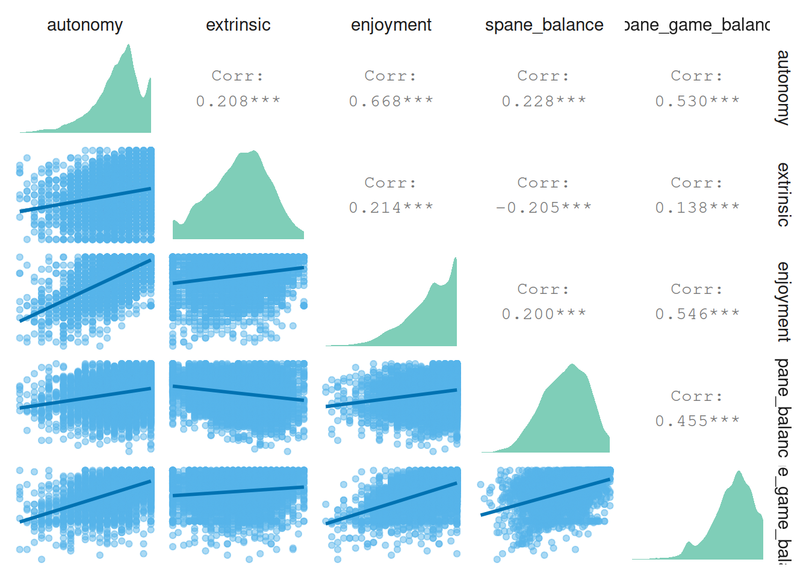

Next relations between self-estimated play (effects) and well-being.

```r
pair_plot(
  dat %>% 
    select(
      Hours,
      active_play,
      within_estimate,
      between_estimate,
      spane_balance,
      spane_game_balance
    )
  )
```

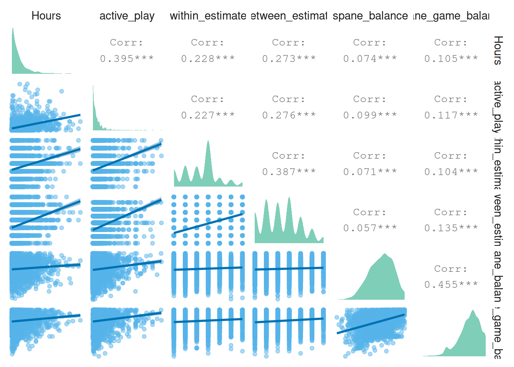

## Plot studies combined

Then, let's plot and describe demographic information first.
The plots in this section will be for both studies combined.

```r
# raincloud plot function from https://github.com/RainCloudPlots/RainCloudPlots/blob/master/tutorial_R/R_rainclouds.R
# Defining the geom_flat_violin function ----
# Note: the below code modifies the
# existing github page by removing a parenthesis in line 50

"%||%" <- function(a, b) {
  if (!is.null(a)) a else b
}

geom_flat_violin <- function(mapping = NULL, data = NULL, stat = "ydensity",
                             position = "dodge", trim = TRUE, scale = "area",
                             show.legend = NA, inherit.aes = TRUE, ...) {
  layer(
    data = data,
    mapping = mapping,
    stat = stat,
    geom = GeomFlatViolin,
    position = position,
    show.legend = show.legend,
    inherit.aes = inherit.aes,
    params = list(
      trim = trim,
      scale = scale,
      ...
    )
  )
}

#' @rdname ggplot2-ggproto
#' @format NULL
#' @usage NULL
#' @export
GeomFlatViolin <-
  ggproto("GeomFlatViolin", Geom,
    setup_data = function(data, params) {
      data$width <- data$width %||%
        params$width %||% (resolution(data$x, FALSE) * 0.9)

      # ymin, ymax, xmin, and xmax define the bounding rectangle for each group
      data %>%
        group_by(group) %>%
        mutate(
          ymin = min(y),
          ymax = max(y),
          xmin = x,
          xmax = x + width / 2
        )
    },

    draw_group = function(data, panel_scales, coord) {
      # Find the points for the line to go all the way around
      data <- transform(data,
        xminv = x,
        xmaxv = x + violinwidth * (xmax - x)
      )

      # Make sure it's sorted properly to draw the outline
      newdata <- rbind(
        plyr::arrange(transform(data, x = xminv), y),
        plyr::arrange(transform(data, x = xmaxv), -y)
      )

      # Close the polygon: set first and last point the same
      # Needed for coord_polar and such
      newdata <- rbind(newdata, newdata[1, ])

      ggplot2:::ggname("geom_flat_violin", GeomPolygon$draw_panel(newdata, panel_scales, coord))
    },

    draw_key = draw_key_polygon,

    default_aes = aes(
      weight = 1, colour = "grey20", fill = "white", size = 0.5,
      alpha = NA, linetype = "solid"
    ),

    required_aes = c("x", "y")
  )

# function that returns summary stats
describe <- function(
  dat,
  variable,
  trait = FALSE
){
  # if variable is not repeated-measures, take only one measure per participant
  if (trait == TRUE){
    dat <- 
      dat %>%
      group_by(player_id) %>% 
      slice(1) %>% 
      ungroup()
  }
  
  # then get descriptives
  descriptives <-
    dat %>%
    filter(!is.na(UQ(sym(variable)))) %>% # remove missing values
    summarise(
      across(
        !! variable,
        list(
          N = ~ n(),
          mean = mean,
          sd = sd,
          median = median,
          min = min,
          max = max,
          cilow = ~Rmisc::CI(.x)[[3]], # lower CI
          cihigh = ~Rmisc::CI(.x)[[1]] # upper CI
        )
      )
    )

  descriptives <-
    descriptives %>%

    # only keep measure
    rename_all(
      ~ str_remove(
        .,
        paste0(variable, "_")
      )
    ) %>%
    mutate(
      variable = variable,
      range = max - min
    ) %>%
    relocate(variable) %>%
    relocate(
      range,
      .after = max
    )
  
  return(descriptives)
}

single_cloud <- 
  function(
    raw_data,
    summary_data,
    variable,
    color,
    title,
    trait = FALSE
  ){
    
    # take only one row per person if it's a trait variable
    if (trait == TRUE){
      raw_data <-
        raw_data %>% 
        group_by(player_id) %>% 
        slice(1) %>% 
        ungroup()
    }
    
    # the plot
    p <- 
      ggplot(
        raw_data %>%
          mutate(Density = 1),
        aes(
          x = Density,
          y = get(variable)
        )
      ) +
      geom_flat_violin( # the "cloud"
        position = position_nudge(x = .2, y = 0),
        adjust = 2,
        color = NA,
        fill = color,
        alpha = 0.5
      ) +
      geom_point( # the "rain"
        position = position_jitter(width = .15),
        size = 1,
        color = color,
        alpha = 0.5
      ) +
      geom_point( # the mean from the summary stats
        data = summary_data %>%
          filter(variable == !! variable) %>%
          mutate(Density = 1),
        aes(
          x = Density + 0.175,
          y = mean
        ),
        color = color,
        size = 2.5
      ) +
      geom_errorbar( # error bars
        data = summary_data %>%
          filter(variable == !! variable) %>%
          mutate(Density = 1),
        aes(
          x = Density + 0.175,
          y = mean,
          ymin = cilow,
          ymax = cihigh
        ),
        width = 0,
        size = 0.8,
        color = color
      ) +
      ylab(title) +
      theme_cowplot() +
      theme(
        axis.text.y = element_blank(),
        axis.ticks.y = element_blank(),
        axis.ticks.x = element_blank(),
        axis.title.y = element_blank(),
        axis.line = element_blank()
      ) +
      guides(
        color = FALSE,
        fill = FALSE
      ) +
      coord_flip()
    
    return(p)
  }

single_cloud(
  dat,
  describe(dat, "age", trait = FALSE),
  "age",
  "#009E73",
  "Distribution of age"
)
```

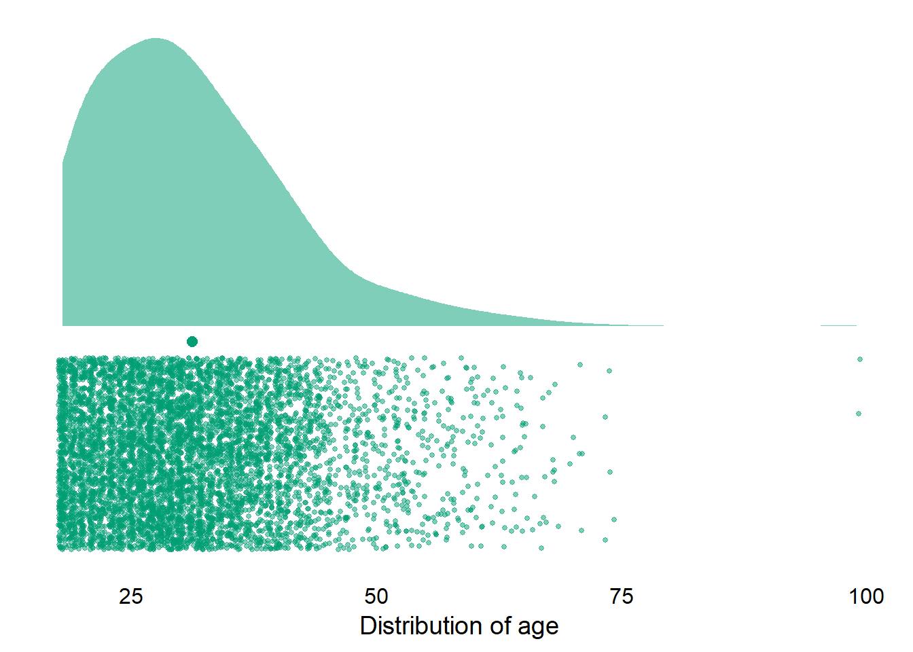

And a check of the variable distributions.

```r
p1 <- 
  single_cloud(
    pvz,
    describe(pvz, "spane_balance", trait = TRUE),
    "spane_balance",
    "#56B4E9",
    title = "SPANE Balance",
    trait = TRUE
  )

p2 <- 
  single_cloud(
    pvz,
    describe(pvz, "autonomy", trait = TRUE),
    "autonomy",
    "#009E73",
    title = "Autonomy",
    trait = TRUE
  )

p3 <- 
  single_cloud(
    pvz,
    describe(pvz, "competence", trait = TRUE),
    "competence",
    "#F0E442",
    title = "Competence",
    trait = TRUE
  )

p4 <- 
  single_cloud(
    pvz,
    describe(pvz, "relatedness", trait = TRUE),
    "relatedness",
    "#000000",
    title = "Relatedness",
    trait = TRUE
  )

p5 <- 
  single_cloud(
    pvz,
    describe(pvz, "enjoyment", trait = TRUE),
    "enjoyment",
    "#0072B2",
    title = "Enjoyment",
    trait = TRUE
  )

p6 <- 
  single_cloud(
    pvz,
    describe(pvz, "extrinsic", trait = TRUE),
    "extrinsic",
    "#D55E00",
    title = "Extrinsic motivation",
    trait = TRUE
  )

p7 <- 
  single_cloud(
    pvz,
    describe(pvz, "active_play", trait = TRUE),
    "active_play",
    "#CC79A7",
    title = "Self-estimated play",
    trait = TRUE
  )

(p1 | p2) / (p3 | p4) / (p5 | p6) / p7
```

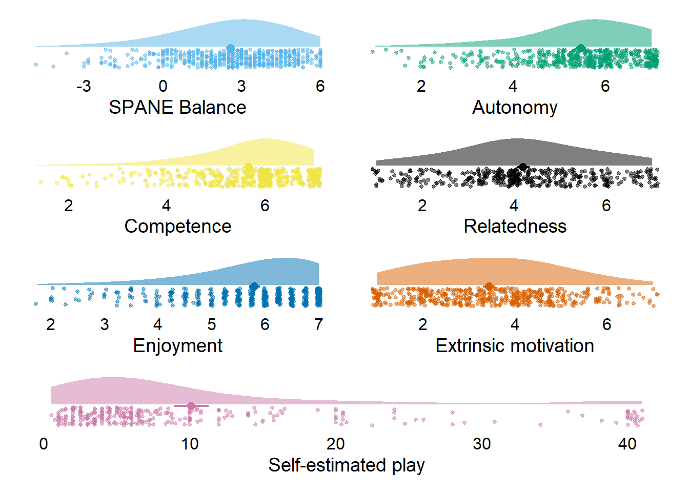

## Create summary figure

Alright, here I'll create a summary figure that shows a beeswarm plot for each of the variables we're interested in.

First, because we'll plot per measure, let's turn the data into the long format.

```r
dat_long <- 
  dat %>% 
  pivot_longer(
    spane_balance:Hours,
    names_to = "Variable",
    values_to = "value"
  ) %>% 
  mutate(Variable = as.factor(Variable))
```

Now, let's get summary stats for each measure.

```r
# function to get summary stats
get_summary <- 
  function(
    dat
  ) {
    summary_stats <- 
      dat %>%
      group_by(Game) %>% 
      summarise(
        across(
          spane_balance:Hours,
          list(
            N = ~ sum(!is.na(.x)),
            Mean = ~ mean(.x, na.rm = TRUE),
            SD = ~ sd(.x, na.rm = TRUE),
            Median = ~ median(.x, na.rm = TRUE),
            Min = ~ min(.x, na.rm = TRUE),
            Max = ~ max(.x, na.rm = TRUE),
            `Lower 95%CI` = ~Rmisc::CI(na.omit(.x))[[3]], # lower CI
            `Upper 95%CI` = ~Rmisc::CI(na.omit(.x))[[1]]
          )
        )
      ) %>% 
      
      # get into long format
      pivot_longer(
        -Game,
        names_to = c("Variable", "Measure"),
        values_to = "Value",
        names_pattern = "(.*)_([^_]+$)" # match by last occurrence of underscore
      ) %>%

      # and back to wide format
      pivot_wider(
        id_cols = c(Game, Variable),
        names_from = Measure,
        values_from = Value
      )
    
    return(summary_stats)
    }

summary_stats <- get_summary(dat)

# rename both so that we have the same order of factor levels for the figure
rename_and_relevel <- 
  function(
    dat
  ) {
    dat <- 
      dat %>% 
      mutate(
        Variable = fct_relevel(
          Variable,
          "SPANE" = "spane_balance",
          "Hours",
          "active_play",
          "autonomy",
          "competence",
          "relatedness",
          "enjoyment",
          "extrinsic"
        ),
        
      Variable = fct_recode(
        Variable,
        "Affective well-being" = "spane_balance",
        "Objective play time" = "Hours",
        "Self-reported play time" = "active_play",
        "Autonomy" = "autonomy",
        "Competence" = "competence",
        "Relatedness" = "relatedness",
        "Enjoyment" = "enjoyment",
        "Extrinsic" = "extrinsic"
      )
    )
    
    return(dat)
  }

dat_long <- rename_and_relevel(dat_long)
summary_stats <- rename_and_relevel(summary_stats)
```

And then the beeswarm plots.

```r
summary_stats <-
  summary_stats %>% 
  group_by(Variable) %>% 
  mutate( # the position of geom_text
    x = max(Max) * 0.85,
    across(
      c(Mean, SD),
      ~ format(round(.x, digits = 1), nsmall = 1)
    )
  )

# a function because we "split" up the plot with patchwork
beeswarm_plots <- 
  function(
    dat,
    subset,
    mean_position,
    sd_position,
    col_font_size,
    row_font_size
  ){
    ggplot(
      dat %>% 
        filter(
          Variable %in% subset
        ),
      aes(
        x = value,
        y = 1,
        color = Game
      )
    ) +
      geom_quasirandom(
        size = 1, 
        groupOnX = FALSE,
        shape = 1,
        alpha = 0.8
      ) +
      facet_grid(
        Game ~ Variable, 
        scales = "free_x"
      ) +
      geom_text(
        data = summary_stats %>% 
          filter(Variable %in% subset),
        aes(
          x = x,
          y = mean_position,
          label = paste0("M = ", Mean)
        ),
        color = "black",
        size = 2.5
      ) +
      geom_text(
        data = summary_stats %>% 
          filter(Variable %in% subset),
        aes(
          x = x,
          y = sd_position,
          label = paste0("SD = ", SD)
        ),
        color = "black",
        size = 2.5
      ) +
      facet_rep_grid(
        Game ~ Variable, 
        scales = "free_x"
      ) +
      scale_color_manual(values=c("navyblue", "#E60012")) +
      theme(
        axis.text.y = element_blank(),
        axis.title.x = element_blank(),
        axis.ticks.y = element_blank(),
        axis.title.y = element_blank(),
        axis.line = element_line(),
        panel.grid.major = element_blank(),
        panel.grid.minor = element_blank(),
        panel.background = element_blank(),
        strip.background.x = element_blank(),
        strip.background.y = element_blank(),
        strip.text.x = element_text(size = col_font_size),
        strip.text.y = element_text(size = row_font_size),
        legend.position = "none"
      ) -> p
    
    return(p)
  }

p1 <- 
  beeswarm_plots(
    dat_long,
    c("Competence", "Relatedness", "Enjoyment", "Extrinsic", "Autonomy"),
    1.65,
    1.5,
    10,
    11
  )

p2 <- 
  beeswarm_plots(
    dat_long,
    c("Affective well-being", "Objective play time", "Self-reported play time"),
    2.0,
    1.8,
    10,
    11
  )

p2 / p1
```

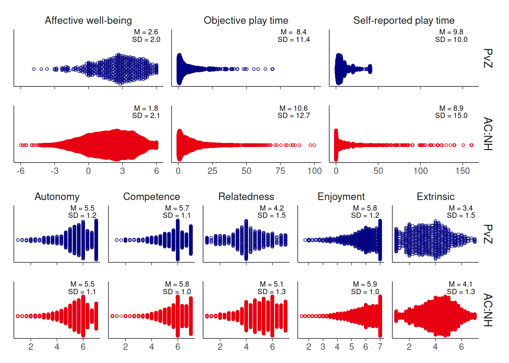
