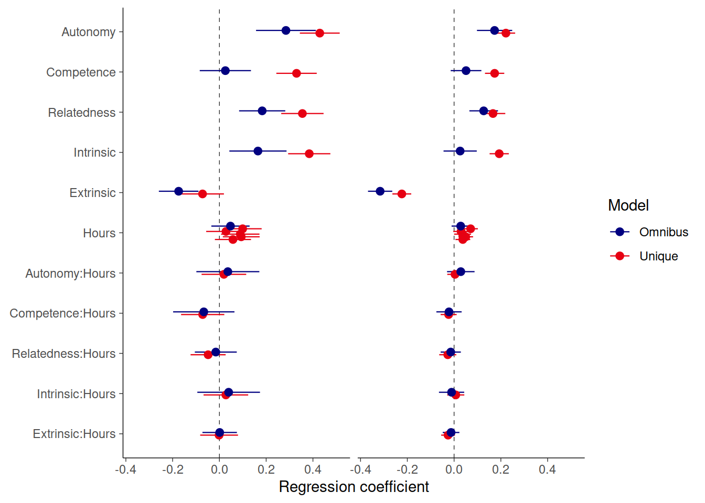

# Analyses


```r
library(pacman)
p_load(
  here,
  knitr,
  patchwork,
  scales,
  broom,
  ggstance,
  tidyverse
)
```


```r
theme_set(
  theme_classic(base_line_size = .25, base_rect_size = 0) +
    theme(
      strip.text = element_text(size = rel(1)),
      strip.background = element_blank(),
      legend.position = "right"
    )
)
colors <- c("navyblue", "#E60012")
```


```r
ac <- read_rds(here("data/noa/ac-excluded.rds"))
pvz <- read_rds(here("data/ea/pvz-excluded.rds"))
ac2 <- read_rds(here("data/noa/ac.rds"))
pvz2 <- read_rds(here("data/ea/pvz.rds"))
```

## Create joint dataset

Create harmonized datasets for easier analysis


```r
ac <- ac %>% 
  select(
    player_id,
    spane_balance, autonomy, 
    competence, relatedness, enjoyment, 
    extrinsic, active_play, Hours
  )
pvz <- pvz %>% 
  select(
    player_id, spane_balance, autonomy, 
    competence, relatedness, enjoyment, 
    extrinsic, active_play, Hours
  )
dat <- bind_rows(pvz, ac, .id = "Game") %>% 
  mutate(Game = factor(Game, labels = c("PvZ", "AC:NH")))
```

Game time is in units of 10 hours to make the size of the coefficients bigger and thus easier to interpret e.g. when shown with 2 decimal points.


```r
dat$Hours10 <- dat$Hours / 10
dat$active_play10 <- dat$active_play / 10
```

## RQ1: Time and well-being

### Objective vs subjective game time

Describe subjective and objective time difference. These numbers are a bit confusing because the means include everyone, but difference only those who had both values (so cannot compute differences from means)


```r
dat %>% 
  group_by(Game) %>%
  mutate(difference = active_play-Hours) %>% 
  summarise(
    across(
      c(Hours, active_play, difference), 
      list(m = ~mean(.x, na.rm = T), s = ~sd(.x, na.rm = T))
      )
    )
#> # A tibble: 2 x 7
#>   Game  Hours_m Hours_s active_play_m active_play_s difference_m difference_s
#>   <fct>   <dbl>   <dbl>         <dbl>         <dbl>        <dbl>        <dbl>
#> 1 PvZ      8.35    11.4          9.77          9.96        1.59          11.8
#> 2 AC:NH   10.6     12.7          8.94         15.0         0.459         15.8
```


```r
p0 <- dat %>% 
  ggplot(aes(Hours, active_play, col = Game)) +
  scale_color_manual(values = colors) +
  geom_point(shape = 1, alpha = .5, size = .5) +
  scale_y_continuous(breaks = pretty_breaks()) +
  scale_x_continuous(breaks = pretty_breaks()) +
  geom_smooth(method = "lm", col = "black", size = .5, alpha = .25) +
  theme(aspect.ratio = 1) +
  guides(
    color = guide_legend(
      override.aes = list(size = 3, shape = 16, alpha = 1)
      )
    ) + 
  facet_wrap("Game", scales = "free", nrow = 2)
```


```r
p1 <- p0 + geom_abline(lty = 2, size = .25)
```

Model fitted separately to both datasets


```r
res <- function(model) {
  out1 <- tidy(model, conf.int = TRUE) %>% 
    select(-statistic) %>% 
    rename(SE = std.error)
  out2 <- glance(model) %>% 
    select(1,2, nobs) %>% 
    rename(r2 = r.squared, r2a = adj.r.squared)
  bind_cols(out1, out2)
}
dat %>% 
  group_by(Game) %>% 
  group_modify(~res(lm(active_play ~ Hours, data = .x))) %>% 
  kable(digits = c(0,2,2,1,3,2,2,2,2,1))
```


|Game  |term        | estimate|  SE| p.value| conf.low| conf.high|   r2|  r2a| nobs|
|:-----|:-----------|--------:|---:|-------:|--------:|---------:|----:|----:|----:|
|PvZ   |(Intercept) |     7.09| 0.5|       0|     6.06|      8.12| 0.15| 0.15|  469|
|PvZ   |Hours       |     0.34| 0.0|       0|     0.27|      0.41| 0.15| 0.15|  469|
|AC:NH |(Intercept) |     5.84| 0.4|       0|     5.13|      6.55| 0.16| 0.16| 2714|
|AC:NH |Hours       |     0.49| 0.0|       0|     0.45|      0.54| 0.16| 0.16| 2714|

### Objective time and SWB


```r
p2 <- p0 + aes(y = spane_balance)
```

Model fitted separately to both datasets


```r
dat %>% 
  group_by(Game) %>% 
  group_modify(~res(lm(scale(spane_balance) ~ Hours10, data = .x))) %>% 
  kable(digits = c(0,2,2,1,3,2,2,2,2,1))
```


|Game  |term        | estimate|  SE| p.value| conf.low| conf.high|   r2|  r2a| nobs|
|:-----|:-----------|--------:|---:|-------:|--------:|---------:|----:|----:|----:|
|PvZ   |(Intercept) |    -0.07| 0.1|   0.200|    -0.19|      0.04| 0.01| 0.01|  468|
|PvZ   |Hours10     |     0.10| 0.0|   0.017|     0.02|      0.18| 0.01| 0.01|  468|
|AC:NH |(Intercept) |    -0.03| 0.0|   0.239|    -0.08|      0.02| 0.01| 0.01| 2537|
|AC:NH |Hours10     |     0.06| 0.0|   0.000|     0.03|      0.09| 0.01| 0.01| 2537|

A separate figure of just this


```r
foo <- function(game, n) {
  tmp <- dat %>% 
    mutate(Game2 = factor(Game, labels = c("Plants vs. Zombies: Battle for Neighborville", "Animal Crossing: New Horizons"))) %>% 
    filter(Game == game)
  tmp %>% 
    ggplot(aes(Hours, spane_balance)) +
    geom_point(alpha = .5, size = 1.75, color = colors[n]) +
    scale_y_continuous(
      "Player wellbeing",
      breaks = pretty_breaks()
    ) +
    scale_x_continuous(
      str_glue("Hours played\n{unique(tmp$Game2)}"),
      breaks = pretty_breaks()
    ) +
    geom_smooth(
      method = "lm", size = .75, alpha = .2,
      col = colors[n], fill = colors[n]
    ) +
    theme(aspect.ratio = 1, legend.position = "none", strip.text = element_blank()) +
    facet_wrap("Game2", scales = "free", nrow = 1)
}
foo("PvZ", 1) | foo("AC:NH", 2)
```


### Subjective time and SWB


```r
p3 <- p0 + aes(x = active_play, y = spane_balance)
```


```r
dat %>% 
  group_by(Game) %>% 
  group_modify(~res(lm(scale(spane_balance) ~ active_play10, data = .x))) %>% 
  kable(digits = c(0,2,2,1,3,2,2,2,2,1))
```


|Game  |term          | estimate|  SE| p.value| conf.low| conf.high|   r2|  r2a| nobs|
|:-----|:-------------|--------:|---:|-------:|--------:|---------:|----:|----:|----:|
|PvZ   |(Intercept)   |    -0.05| 0.1|   0.433|    -0.17|      0.07| 0.00| 0.00|  516|
|PvZ   |active_play10 |     0.05| 0.0|   0.264|    -0.04|      0.14| 0.00| 0.00|  516|
|AC:NH |(Intercept)   |    -0.07| 0.0|   0.000|    -0.10|     -0.04| 0.01| 0.01| 5487|
|AC:NH |active_play10 |     0.07| 0.0|   0.000|     0.05|      0.08| 0.01| 0.01| 5487|

### Figure


```r
(p1 + 
   labs(x = "Hours played", y = "Estimated hours") +
   theme(legend.position = "none") | 
  p2 + 
   labs(x = "Hours played", y = "Well-being") +
   theme(legend.position = "none") | 
  p3 + 
   labs(x = "Estimated hours", y = "Well-being") +
   theme(legend.position = "right")
 ) &
  plot_annotation(tag_levels = "A") &
  theme(strip.text = element_blank())
```


## RQ2: Well-being and motivation


```r
# Nice names for plots
dat <- dat %>% rename_all(str_to_title)

dat <- dat %>% 
  rename(Intrinsic = Enjoyment)

# Standardize everything
# Hours (centered) is divided by 10 to put on same scale with others.
dat <- dat %>%
  group_by(Game) %>% 
  mutate(
    across(Spane_balance:Extrinsic, ~as.numeric(scale(., T, T))),
    Hours = as.numeric(scale(Hours10, T, F))
    )

# Fit all models to both datasets
xs <- dat %>% 
  group_by(Game) %>% 
  nest() %>% 
  mutate(
    # Omnibus model where variables work together
    x = map(data, ~lm(Spane_balance ~ (Autonomy + Competence + Relatedness + Intrinsic + Extrinsic) * Hours, data = .x)),
    # Separate models for variables to work alone
    x1 = map(data, ~lm(Spane_balance ~ Autonomy * Hours, data = .x)),
    x2 = map(data, ~lm(Spane_balance ~ Competence * Hours, data = .x)),
    x3 = map(data, ~lm(Spane_balance ~ Relatedness * Hours, data = .x)),
    x4 = map(data, ~lm(Spane_balance ~ Intrinsic * Hours, data = .x)),
    x5 = map(data, ~lm(Spane_balance ~ Extrinsic * Hours, data = .x))
  )
```


```r
tmp <- xs %>% 
  pivot_longer(x:x5, names_to = "Model") %>% 
  mutate(Model = ifelse(Model=="x", 'Omnibus', 'Unique')) %>% 
  mutate(out = map(value, ~tidy(., conf.int = TRUE))) %>% 
  unnest(out) %>% 
  filter(!(term %in% c('(Intercept)'))) %>%
  mutate(term = fct_rev(fct_inorder(term))) %>% 
  mutate(
    Type = factor(
      str_detect(term, ":"), labels = c("Main effect", "Moderation")
    )
  ) 

p1 <- tmp %>% 
  filter(Model == "Omnibus") %>% 
  drop_na() %>% 
  ggplot(aes(estimate, term, col = Game)) +
  scale_color_manual(values = colors) +
  scale_x_continuous(
    'Regression coefficient', breaks = pretty_breaks()
  ) +
  geom_vline(xintercept = 0, lty = 2, size = .2) +
  geom_pointrangeh(
    aes(xmin = conf.low, xmax = conf.high), 
    size = .4, position = position_dodge2v(.4)
    ) +
  theme(
    axis.title.y = element_blank(), 
    strip.text = element_blank()
    )
p1
```


```r
map(xs$x, res)
#> [[1]]
#> # A tibble: 12 x 9
#>    term            estimate     SE  p.value conf.low conf.high    r2   r2a  nobs
#>    <chr>              <dbl>  <dbl>    <dbl>    <dbl>     <dbl> <dbl> <dbl> <int>
#>  1 (Intercept)      0.0162  0.0428  7.06e-1  -0.0680    0.100  0.291 0.272   404
#>  2 Autonomy         0.285   0.0650  1.55e-5   0.157     0.412  0.291 0.272   404
#>  3 Competence       0.0255  0.0557  6.48e-1  -0.0840    0.135  0.291 0.272   404
#>  4 Relatedness      0.183   0.0502  3.05e-4   0.0843    0.282  0.291 0.272   404
#>  5 Intrinsic        0.165   0.0622  8.37e-3   0.0426    0.287  0.291 0.272   404
#>  6 Extrinsic       -0.174   0.0431  6.27e-5  -0.259    -0.0896 0.291 0.272   404
#>  7 Hours            0.0474  0.0416  2.55e-1  -0.0344    0.129  0.291 0.272   404
#>  8 Autonomy:Hours   0.0361  0.0685  5.98e-1  -0.0985    0.171  0.291 0.272   404
#>  9 Competence:Hou~ -0.0667  0.0667  3.18e-1  -0.198     0.0644 0.291 0.272   404
#> 10 Relatedness:Ho~ -0.0154  0.0456  7.36e-1  -0.105     0.0743 0.291 0.272   404
#> 11 Intrinsic:Hours  0.0396  0.0681  5.62e-1  -0.0944    0.174  0.291 0.272   404
#> 12 Extrinsic:Hours  0.00121 0.0375  9.74e-1  -0.0724    0.0749 0.291 0.272   404
#> 
#> [[2]]
#> # A tibble: 12 x 9
#>    term            estimate     SE  p.value conf.low conf.high    r2   r2a  nobs
#>    <chr>              <dbl>  <dbl>    <dbl>    <dbl>     <dbl> <dbl> <dbl> <int>
#>  1 (Intercept)       0.125  0.0256 1.23e- 6   0.0745    0.175  0.145 0.138  1430
#>  2 Autonomy          0.173  0.0384 7.03e- 6   0.0978    0.248  0.145 0.138  1430
#>  3 Competence        0.0511 0.0334 1.26e- 1  -0.0144    0.117  0.145 0.138  1430
#>  4 Relatedness       0.127  0.0312 5.23e- 5   0.0654    0.188  0.145 0.138  1430
#>  5 Intrinsic         0.0260 0.0362 4.74e- 1  -0.0451    0.0970 0.145 0.138  1430
#>  6 Extrinsic        -0.316  0.0264 1.56e-31  -0.368    -0.264  0.145 0.138  1430
#>  7 Hours             0.0283 0.0199 1.55e- 1  -0.0107    0.0672 0.145 0.138  1430
#>  8 Autonomy:Hours    0.0287 0.0300 3.38e- 1  -0.0301    0.0876 0.145 0.138  1430
#>  9 Competence:Hou~  -0.0217 0.0275 4.31e- 1  -0.0757    0.0323 0.145 0.138  1430
#> 10 Relatedness:Ho~  -0.0142 0.0220 5.18e- 1  -0.0574    0.0289 0.145 0.138  1430
#> 11 Intrinsic:Hours  -0.0107 0.0275 6.97e- 1  -0.0647    0.0433 0.145 0.138  1430
#> 12 Extrinsic:Hours  -0.0129 0.0182 4.76e- 1  -0.0486    0.0227 0.145 0.138  1430
```

We also compared the omnibus estimates to independent estimates


```r
p1 %+%
  drop_na(tmp) +
  aes(col = Model) +
  facet_wrap("Game")
```



## Nonlinear models

We also investigated potential nonlinear relations between game time and wellbeing. We did so by fitting a model with and without a smooth term, and using AIC to compare the models.


```r
dat %>%
  select(Game, Spane_balance, Hours10, Active_play10) %>% 
  pivot_longer(contains("10")) %>% 
  ggplot(aes(value, Spane_balance)) +
  geom_point() +
  geom_smooth(method = "lm", aes(col = "linear")) +
  geom_smooth(method = "gam", aes(col = "GAM")) +
  facet_grid(name~Game, scales = "free")
```


```r
library(mgcv)
dat %>% 
  select(Game, Spane_balance, Hours10, Active_play10) %>% 
  pivot_longer(contains("10"), names_to = "Variable") %>%
  group_by(Game, Variable) %>% 
  nest() %>% 
  mutate(linear = map(data, ~gam(Spane_balance ~ value, data = .x))) %>% 
  mutate(smooth = map(data, ~gam(Spane_balance ~ s(value), data = .x))) %>% 
  pivot_longer(linear:smooth, names_to = "Model") %>% 
  mutate(AIC = map_dbl(value, AIC)) %>% 
  select(Game, Variable, Model, AIC) %>% 
  pivot_wider(names_from = Model, values_from = AIC) %>% 
  mutate(Difference = linear-smooth) %>% 
  kable(digits = 1)
```


|Game  |Variable      |  linear|  smooth| Difference|
|:-----|:-------------|-------:|-------:|----------:|
|PvZ   |Hours10       |  1337.7|  1337.7|        0.0|
|PvZ   |Active_play10 |  1468.1|  1464.4|        3.7|
|AC:NH |Hours10       |  7218.9|  7218.2|        0.8|
|AC:NH |Active_play10 | 15512.7| 15506.6|        6.1|

## System information


```r
sessionInfo()
#> R version 4.0.2 (2020-06-22)
#> Platform: x86_64-w64-mingw32/x64 (64-bit)
#> Running under: Windows 10 x64 (build 18363)
#> 
#> Matrix products: default
#> 
#> locale:
#> [1] LC_COLLATE=English_United States.1252 
#> [2] LC_CTYPE=English_United States.1252   
#> [3] LC_MONETARY=English_United States.1252
#> [4] LC_NUMERIC=C                          
#> [5] LC_TIME=English_United States.1252    
#> 
#> attached base packages:
#> [1] stats     graphics  grDevices utils     datasets  methods   base     
#> 
#> other attached packages:
<<<<<<< HEAD
#>  [1] mgcv_1.8-33     nlme_3.1-150    forcats_0.5.0   stringr_1.4.0  
#>  [5] dplyr_1.0.2     purrr_0.3.4     readr_1.4.0     tidyr_1.1.2    
#>  [9] tibble_3.0.4    ggplot2_3.3.2   tidyverse_1.3.0 ggstance_0.3.4 
#> [13] broom_0.7.2     scales_1.1.1    patchwork_1.1.0 knitr_1.30     
#> [17] here_1.0.1      pacman_0.5.1   
#> 
#> loaded via a namespace (and not attached):
#>  [1] Rcpp_1.0.5        lubridate_1.7.9.2 lattice_0.20-41   assertthat_0.2.1 
#>  [5] rprojroot_2.0.2   digest_0.6.27     utf8_1.1.4        R6_2.5.0         
#>  [9] cellranger_1.1.0  backports_1.2.1   reprex_0.3.0      evaluate_0.14    
#> [13] httr_1.4.2        highr_0.8         pillar_1.4.7      rlang_0.4.9      
#> [17] readxl_1.3.1      rstudioapi_0.13   Matrix_1.2-18     rmarkdown_2.6    
#> [21] labeling_0.4.2    splines_4.0.3     munsell_0.5.0     compiler_4.0.3   
#> [25] modelr_0.1.8      xfun_0.19         pkgconfig_2.0.3   htmltools_0.5.0  
#> [29] tidyselect_1.1.0  bookdown_0.21     fansi_0.4.1       crayon_1.3.4     
#> [33] dbplyr_2.0.0      withr_2.3.0       grid_4.0.3        jsonlite_1.7.2   
#> [37] gtable_0.3.0      lifecycle_0.2.0   DBI_1.1.0         magrittr_2.0.1   
#> [41] cli_2.2.0         stringi_1.5.3     farver_2.0.3      fs_1.5.0         
#> [45] xml2_1.3.2        ellipsis_0.3.1    generics_0.1.0    vctrs_0.3.5      
#> [49] tools_4.0.3       glue_1.4.2        hms_0.5.3         parallel_4.0.3   
#> [53] yaml_2.2.1        colorspace_2.0-0  rvest_0.3.6       haven_2.3.1
=======
#>  [1] mgcv_1.8-31      nlme_3.1-148     forcats_0.5.0    stringr_1.4.0   
#>  [5] dplyr_1.0.0      purrr_0.3.4      readr_1.3.1      tidyr_1.1.0     
#>  [9] tibble_3.0.3     ggplot2_3.3.2    tidyverse_1.3.0  ggstance_0.3.4  
#> [13] broom_0.7.0.9001 scales_1.1.1     patchwork_1.0.1  knitr_1.29      
#> [17] here_0.1         pacman_0.5.1    
#> 
#> loaded via a namespace (and not attached):
#>  [1] Rcpp_1.0.5       lubridate_1.7.9  lattice_0.20-41  assertthat_0.2.1
#>  [5] rprojroot_1.3-2  digest_0.6.25    utf8_1.1.4       R6_2.4.1        
#>  [9] cellranger_1.1.0 backports_1.1.8  reprex_0.3.0     evaluate_0.14   
#> [13] httr_1.4.1       highr_0.8        pillar_1.4.6     rlang_0.4.7     
#> [17] readxl_1.3.1     rstudioapi_0.11  blob_1.2.1       Matrix_1.2-18   
#> [21] rmarkdown_2.5    labeling_0.3     splines_4.0.2    munsell_0.5.0   
#> [25] compiler_4.0.2   modelr_0.1.8     xfun_0.15        pkgconfig_2.0.3 
#> [29] htmltools_0.5.0  tidyselect_1.1.0 bookdown_0.20    fansi_0.4.1     
#> [33] crayon_1.3.4     dbplyr_1.4.4     withr_2.2.0      grid_4.0.2      
#> [37] jsonlite_1.7.0   gtable_0.3.0     lifecycle_0.2.0  DBI_1.1.0       
#> [41] magrittr_1.5     cli_2.0.2        stringi_1.4.6    farver_2.0.3    
#> [45] fs_1.4.2         xml2_1.3.2       ellipsis_0.3.1   generics_0.0.2  
#> [49] vctrs_0.3.2      tools_4.0.2      glue_1.4.1       hms_0.5.3       
#> [53] yaml_2.2.1       colorspace_1.4-1 rvest_0.3.5      haven_2.3.1
>>>>>>> f449c935d496bcb159c5533847257a56a9918a85
```
